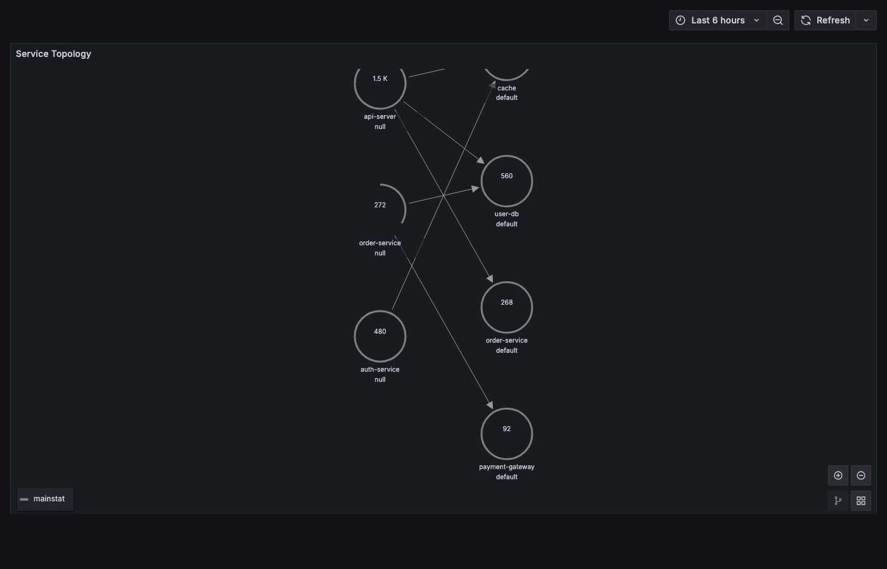

# Service Topology Map

Auto-discovered service dependency graph from eBPF TCP peer data. Zero new BPF programs — pure Kotlin aggregation over existing `TcpPeerCollector` data.


## How It Works

The topology map groups TCP connections by service, building a directed graph of service-to-service communication with rich edge metadata:

- **Request count** per edge
- **Average latency** from TCP RTT
- **Protocol inference** from well-known ports (HTTP, Redis, MySQL, PostgreSQL)
- **External node capping** (top 20 by traffic, rest merged into "other-external")
- **Sliding window** (10 snapshots x 29s = ~5 min of data)

## API

```
GET /actuator/kpodTopology
```

Returns a [Grafana Node Graph](https://grafana.com/docs/grafana/latest/panels-visualizations/visualizations/node-graph/) compatible response:

```json
{
  "nodes": [
    { "id": "frontend", "title": "frontend", "mainStat": "195", "arc__http": 1.0 }
  ],
  "edges": [
    { "source": "frontend", "target": "default/api-server", "mainStat": "142", "secondaryStat": "12ms avg" }
  ]
}
```

## Grafana Dashboard



A Node Graph dashboard is included at `helm/kpod-metrics/dashboards/topology.json`. It requires the [Infinity data source plugin](https://grafana.com/grafana/plugins/yesoreyeram-infinity-datasource/).

## Configuration

```yaml
kpod:
  topology:
    enabled: true       # default
    windowSize: 10      # number of snapshots in sliding window
    maxExternalNodes: 20 # cap external nodes, rest merged into "other-external"
    demoData: false     # inject sample data for testing
```

## Demo Mode

To see the topology with sample data (useful for testing Grafana dashboard setup):

```bash
helm install kpod-metrics ./helm/kpod-metrics \
  --set topology.demoData=true
```
